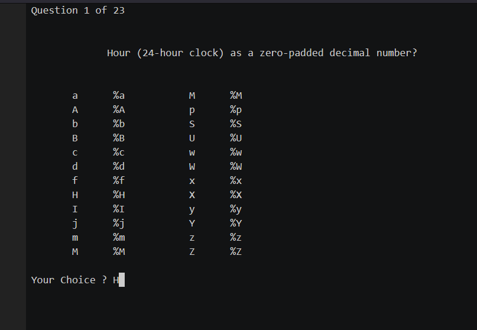

# Python datetime quiz
A Python quiz on datetime strftime/strptime codes, written in Python3

 ## Instructions

Clone the repository
`cd quiz_datetime`
`python3 quiz.py`

  ## Sample Screenshot

  ## Sample Asciinema Recording

[click here](https://asciinema.org/a/STqd6oJvLubAD5x8GFUl16HWR)

